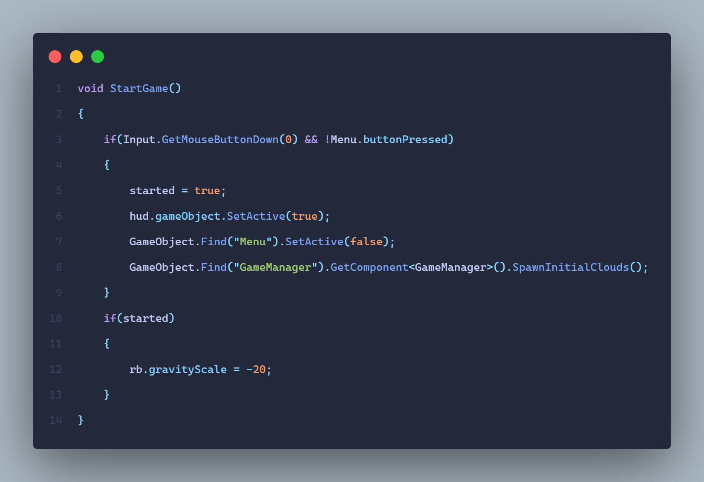
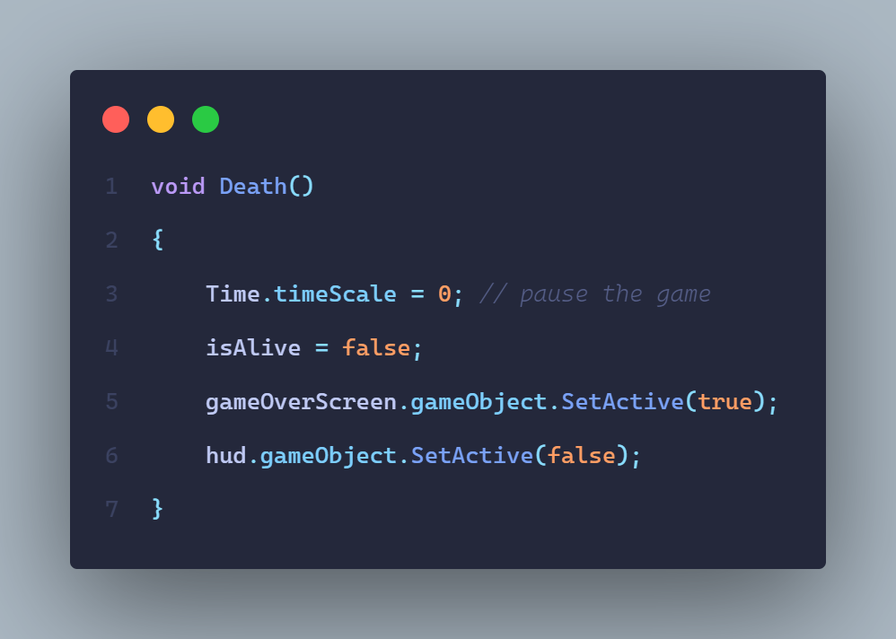
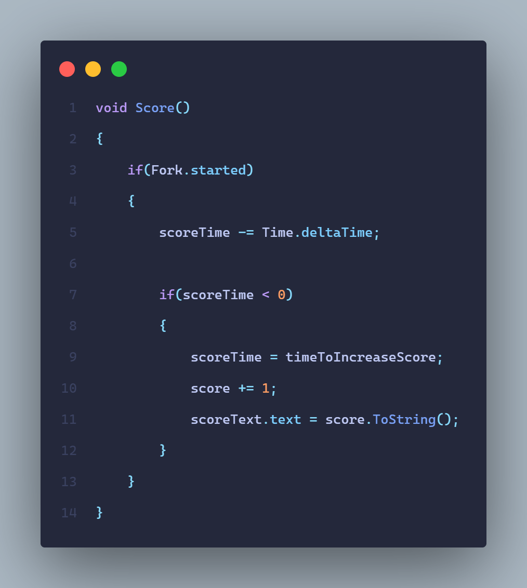
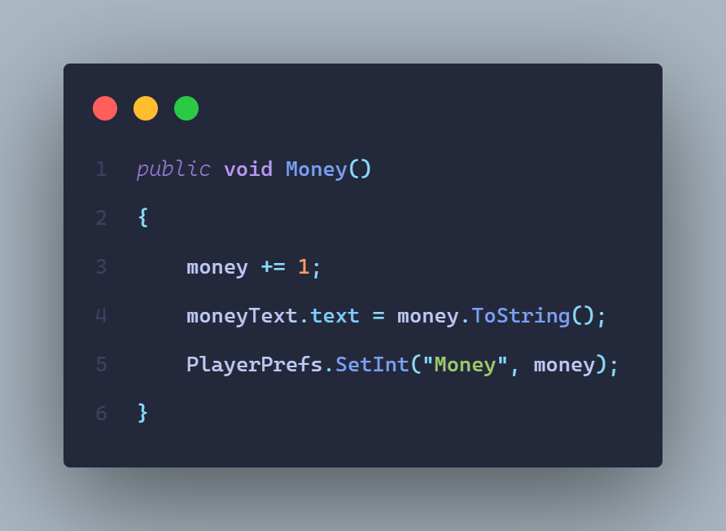
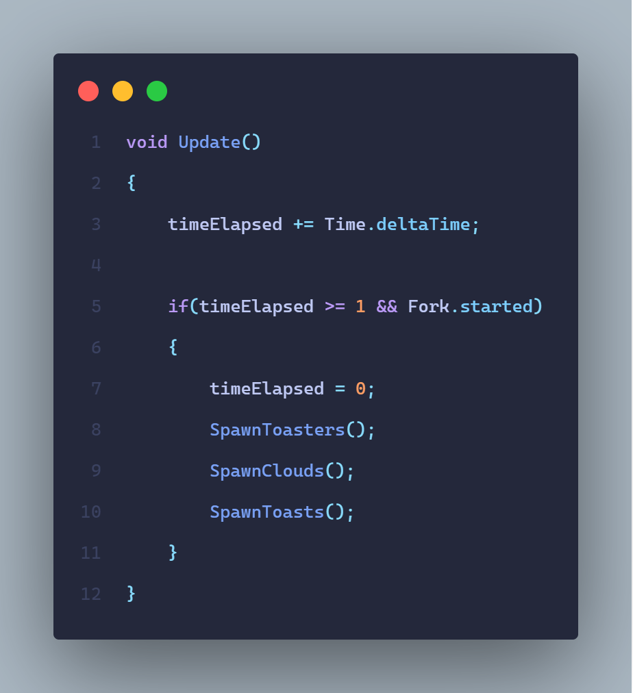
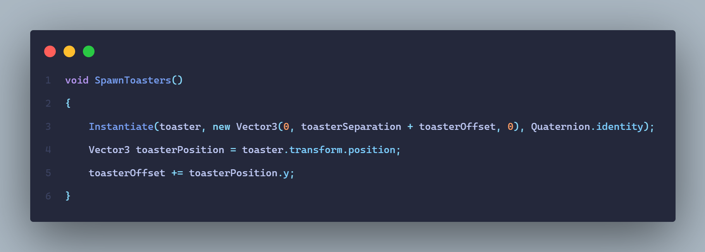
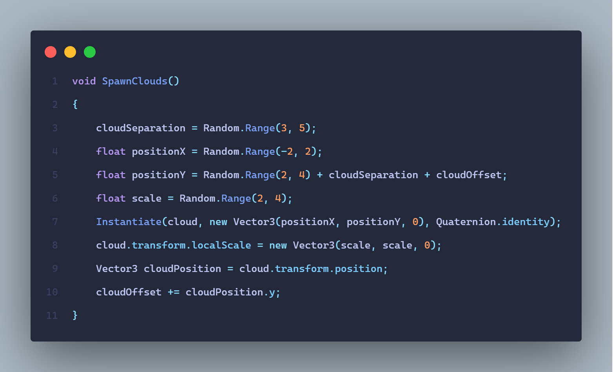
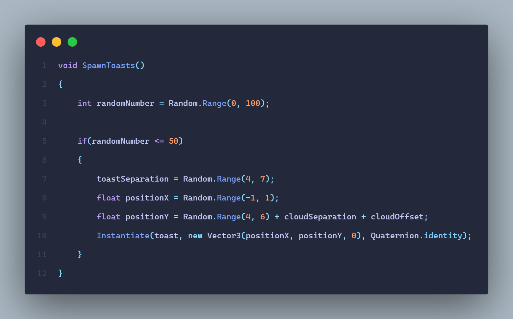

# Escape-The-Toaster
* Practica de mecanicas avanzadas en Unity. Primer proyecto bastante completo y de nivel mas avanzado realizado de manera autodidacta

---

# Script [Player](https://github.com/MarcoPaoletta/Escape-The-Toaster/blob/main/Assets/Scripts/Player.cs)

## Inicio del juego

* Si presionamos el click izquierdo y no estamos tocando en ningun boton del menu:
  * Cambiamos la variable `started` a verdadero
  * Mostramos el hud
  * Ocultamos el menu
  * Spawneamos las primeras nubes del fondo
* Si el juego ya esta iniciado:
  * Establecemos una gravedad negativa para nuestro RigidBody2D (cuya referencia es `rb`) para que vaya hacia arriba

---

## Muerte

* Modificando `timeScale` a 0 logramos que se pause el juego
* Cambiamos la variable `isAlive` a falso que es la que maneja si el jugador esta o no vivo
* Mostramos la pantalla de GameOver
* Ocultamos el hud 

---

# Script [HUD](https://github.com/MarcoPaoletta/Escape-The-Toaster/blob/main/Assets/Scripts/HUD.cs)

## Puntuacion

* Si el juego esta iniciado:
  * Restamos a la variable `scoreTime` el tiempo actual
  * Si la variable `scoreTime` es menor a 0:
    * Reseteamos el valor de la variable `scoreTime` usando la variable `timeToIncreaseScore`
    * Aumentamos la variable `score`
    * Cambiamos el `scoreText.text`

---

## Dinero

* Aumentamos la variable `money`
* Cambiamos el `moneyText.text`
* Guardamos usando `PlayerPrefs` la cantidad de dinero

---

# Script [GameManager](https://github.com/MarcoPaoletta/Escape-The-Toaster/blob/main/Assets/Scripts/GameManager.cs)

## Spawn de objetos cada 1 segundo

* Aumentamos la variable `timeElapsed` el tiempo acutal
* Si paso 1 segundo y el juego esta iniciado:
  * Reseteamos el valor de la variable `timeElapsed`
  * Llamamos a las distintas funciones para spawnear los objetos

---

## Spawn de las tostadoras

* Instanciamos la tostadora en posicion 0 de X, la posicion Y se va a basar en una `toasterSeparation` que establece la separacion constante entre cada tostadora mas un `toasterOffset` que va a ir aumentando cada vez que se ejecute la funcion
* Actualizamos el valor de la variable `toasterOffset` teniendo en cuenta la posicion Y de la ultima tostadora creada
    > De esta manera logramos que las tostadoras se spawnen de manera procedural teniendo en cuenta una separacion entre cada tostadora y un offset que va a ir aumentando dependiendo de la posicion de la ultima tostadora creada

---

## Spawn de las nubes

* Asignamos el valor de la variable `cloudSeparation` entre un rango de 3 y 5 que sera la separacion entre cada nube
* Creamos dos variables `positionX` y `positionY` con un valor tambien aleatorio. No obstante a la variable `positionY` le sumamos las variables antes asignadas `cloudSeparation` y `cloudOffset`
* Creamos otra variable `scale` para la escala de la nube
* Instanciamos la nube usando las variables `positionX` y `positionY`
* Modificamos la escala usando la variable `scale`
* Hacemos el mismo procedimiendo que en el spawneo de las tostadoras: actualizamos el valor de la variable `cloudOffset` teniendo en cuenta la posicion Y de la ultima nube creada
    > De esta manera logramos que las nubes se spawnen de manera procedural teniendo en cuenta una separacion entre cada nube y un offset que va a ir aumentando dependiendo de la posicion de la ultima nube creada

---

## Spawn de las tostadas

* Asignamos el valor de la variable `randomNumber` entre un rango de 0 y 100
* Vamos a utilizar esta variable para que las siguientes lineas de codigo se ejecuten en un 50% de posibilidad:
  * Asignamos valores aleatorios a las variables `toastSeparation`, `positionX` y `positionY`. No obstante a la variable `positionY` le sumamos las variables antes asignadas `cloudSeparation` y `cloudOffset` 
    >  Usamos las mismas variables `cloudSeparation` y `cloudOffset` ya que no es necesario crear nuevas y si lo hariamos obtendriamos resultados similares

---

# Descargar Unity, ejecutar el proyecto y utilizar Visual Studio

## Descargar Unity
* Dirigirnos al [sitio oficial de descarga](https://unity.com/download) de Unity y descargar el hub como cualquier otra aplicacion simplemente tocando siguiente, siguiente, siguiente
* Una vez instalado, nos dirigimos  a la parte de `Installs`, luego en `ADD` e instalamos la version de Unity utilizada en este proyecto que es la `2020.3.28f1`
* Lo siguiente es seleccionar los modulos. El unico que vamos a seleccionar es el que dice `Microsoft Visual Studio Community` seguido de un año que puede ir cambiando
* Esperamos a que se instale y ya estaria

---

## Ejecutar el proyecto
* Nos dirigimos a la parte de `Installs`, luego en `OPEN` y abrimos la carpeta del proyecto la cual deberia de tener una carpeta con el nombre del proyecto, por ejemplo `John And Grunt` y otra con el nombre `My project`
* Con esto, ya tendremos el proyecto importado

---

## Utilizar Visual Studio
* Con todos los pasos anteriores ya se puede ejecutar y probar el proyecto, no obstante, no podemos realizar cambio en ningun script ya que Unity no tiene ningun IDE o editor de texto incluido
* Entonces, descargamos [Visual Studio](https://visualstudio.microsoft.com/es/downloads/) como cualquier otra aplicacion simplemente tocando siguiente, siguiente, siguiente
* Lo siguiente es seleccionar los modulos. Los modulos que vamos a seleccionar son: `.NET desktop development`  y `Game development with Unity`
* Vamos a algun proyecto de Unity, tocamos en `Edit` -> `Preferences` -> `External Tools` -> `External Script Editor` y seleccionamos `Microsoft Visual Studio Community` seguido de un año que puede ir cambiando
* Ahora, podremos modificar los scripts de Unity que son escritos en C#
